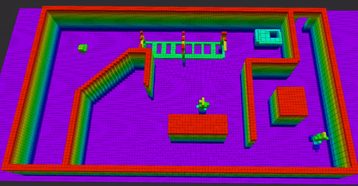

# Quadrotor path planning
This repo contains implementation of Informed RRT* path planning using various sampling strategies. The sampling strategies tested are
Uniform sampling, Obstacle-based sampling, Gaussian sampling and Max clearance based sampling. The waypoints generated by RRT* are then converted into minimum jerk trajectory which can be safely executed by quadrotor.
Simulator used is [RotorS simulator](https://github.com/ethz-asl/rotors_simulator) and a custom world in gazebo is used to test planning.
Different gazebo worlds can also be used, but the octomap should be constructed and then initialized in the program. The gazebo file used in the 
project is ```quad_gazebo_world``` which is made available in the repo. Also, download and setup  RotorS simulator 
by following the instructions in its repo before running this project.

At first, the RotorS simulator is setup and run using the following launch file. 
```
roslaunch rotors_gazebo mav_hovering_example.launch mav_name:=firefly world_name:=quad_gazebo_world
```
The path planning nodes then can be run using the following launch file,

```
roslaunch path_planning path_planning.launch
```

In order to run benchmarking for different types of sampling strategies, run the following launch file:
```
roslaunch path_planning benchmark.launch
```

##Path planning visualization
Visualization of path planning of quadrotor from one point to other is shown below. Gazebo and Rviz visualizations
are shown below. In Rviz, green one is orginal trajectory and red one is the jerk minimal trajectory. The planning
time is restricted to just 5 seconds. When more time is allowed, the path obtained gets shorter and more smooth as well.

<p align="center">
  
</p>
<p align="center">
  
</p>

